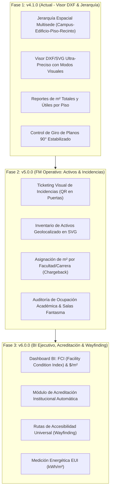

# 🗺️ MInfra - Roadmap Estratégico & Análisis de Funcionalidades FM (Facility Management)

## 📌 Visión General
Transformar **MInfra** en un sistema **CAFM/IWMS (Computer-Aided Facility Management)** especializado para educación superior y redes multisede. Combina la potencia del modelo de información geográfica/CAD (DXF/SVG) con los estándares internacionales de Facility Management (ISO 41001, IFMA).

---

## 🏛️ Análisis de Funcionalidades de Sistemas FM Aplicadas a la Universidad

| Módulo FM Tradicional | Aplicación e Impacto en la Universidad | Nivel de Prioridad |
| :--- | :--- | :---: |
| **1. Space Allocation & Internal Chargeback** *(Asignación e Imputación de Espacios)* | **Imputación de $m^2$ por Facultad/Carrera:** Distribución del costo operativo inmobiliario ($/m²) según los metros que ocupa cada Facultad (Ingeniería, Medicina, Derecho), permitiendo calcular la rentabilidad real de cada carrera. | **Alta** (Fase 2) |
| **2. Visual CMMS & Mantenimiento Programado** *(Preventivo y Correctivo)* | **Rutinas en Recesos Académicos:** Programación de mantenimiento preventivo de laboratorios, climatización, ascensores y subestaciones durante vacaciones (Enero/Febrero/Julio) para cero interrupción de clases. | **Alta** (Fase 2) |
| **3. Timetable Gap & "Ghost Rooms"** *(Auditoría de Ocupación Académica)* | **Salas Fantasma vs Capacidad Real:** Cruce entre el horario académico (Banner/SIRA) y el plano. Identifica aulas reservadas pero vacías en la práctica, liberando cupos sin necesidad de construir más m². | **Alta** (Fase 2) |
| **4. Campus Wayfinding & Accesibilidad Universal** *(Navegación Táctil)* | **Inclusión y Bienvenida:** Trazado de rutas accesibles (rampas, ascensores habilitados) para estudiantes con movilidad reducida y visitas, cumpliendo normativas de inclusión educativa. | **Media** (Fase 3) |
| **5. Compliance & Acreditación Institucional** *(CNA / ODUCAL / ISO)* | **Dossier Automático de Acreditación:** Generación en 1 clic de reportes de metros por alumno, capacidad de laboratorios de bioseguridad y aforos exigidos por agencias acreditadoras. | **Alta** (Fase 3) |
| **6. Smart ESG & Eficiencia Energética** *(Sostenibilidad Campus)* | **Indicador EUI ($kWh/m^2$):** Medición del consumo eléctrico y de agua por edificio/piso. Integración con reglas de apagado automático de luces/climatización al finalizar bloques académicos. | **Media** (Fase 3) |
| **7. Gestor de Arriendos & Espacios de Terceros** *(Lease Management)* | **Monetización de Infraestructura:** Control de espacios arrendados a terceros dentro del campus (cafeterías, fotocopiadoras, bancos, cajeros) y arriendo de auditorios/canchas en fines de semana. | **Baja** (Fase 4) |

---

## 🗓️ Hoja de Ruta Actualizada por Fases

---

## 📑 Matriz de Valor por Rol en la Universidad

* **Vicerrectoría de Administración y Finanzas:** Justificación de presupuestos de infraestructura basada en m² reales utilizados por carrera y ahorro energético.
* **Comisión de Acreditación:** Obtención instantánea de evidencias de laboratorio, aforos e infraestructura exigidas por agencias nacionales/internacionales.
* **Director de Operaciones / Mantención:** Reducción de tiempos de atención de fallas al visualizar incidentes marcados en rojo directamente en el plano del piso.
* **Decanos y Directores de Escuela:** Visibilidad transparente de los metros cuadrados asignados a su facultad.

---
*Documento actualizado en repositorios para consulta estratégica.*
