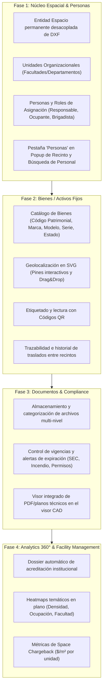

# 🗺️ MInfra - Roadmap Estratégico & Análisis de Funcionalidades FM (Facility Management)

## 📌 Visión General
Transformar **MInfra** en un sistema **CAFM/IWMS (Computer-Aided Facility Management)** especializado para educación superior y redes multisede. Combina la potencia del modelo de información geográfica/CAD (DXF/SVG) con los estándares internacionales de Facility Management (ISO 41001, IFMA).

---

## 🏛️ Análisis de Funcionalidades de Sistemas FM Aplicadas a la Universidad

| Módulo FM Tradicional | Aplicación e Impacto en la Universidad | Nivel de Prioridad |
| :--- | :--- | :---: |
| **1. Space Management & Organizaciones** | **Jerarquía y Desacoplamiento CAD:** Control de Sedes, Edificios, Pisos y Espacios persistentes con vinculación de Unidades Organizacionales (Facultades/Departamentos). | **Alta** (Fase 1) |
| **2. People & Occupancy Management** | **Personas y Responsables:** Asignación de puestos, custodios de recinto, líderes de emergencia y control de aforos/ocupación. | **Alta** (Fase 1) |
| **3. Asset Tracking & QR Geolocalizado** | **Inventario de Bienes en SVG:** Control de mobiliario, equipos TI, climatización y laboratorios con trazabilidad y códigos QR. | **Alta** (Fase 2) |
| **4. Document Management & Compliance** | **Expedientes de Infraestructura:** Títulos, permisos de edificación, certificados SEC de ascensores/gases, manuales y pólizas con alertas de vencimiento. | **Alta** (Fase 3) |
| **5. Space Allocation & Chargeback** | **Imputación de $m^2$ por Facultad/Carrera:** Distribución del costo operativo inmobiliario ($/m²) según los metros que ocupa cada Facultad. | **Media** (Fase 4) |
| **6. Compliance & Acreditación Institucional** | **Dossier Automático de Acreditación:** Generación de reportes de metros por alumno, capacidad de laboratorios y aforos exigidos (CNA/ISO). | **Alta** (Fase 4) |

---

## 🗓️ Hoja de Ruta de Módulos

---

## 📑 Documento Detallado de Arquitectura
Para consultar el detalle de modelos, tablas y consideraciones de despliegue en OCI e3micro (Ubuntu minimal), ver:
[`docs/architecture/roadmap-fases-modulos.md`](docs/architecture/roadmap-fases-modulos.md).
