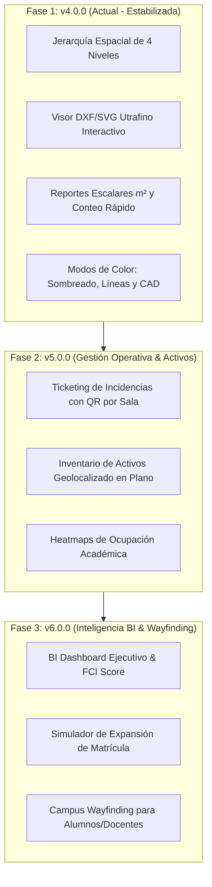

# 🗺️ MInfra - Roadmap Estratégico & Visión de Producto

## 📌 Visión General
Transformar el módulo de infraestructura (**MInfra**) en una suite integral corporativa de **Facility & Space Management (FM)** diseñada para instituciones educativas y corporativas de nivel **Nacional, Regional y Multisede**.

Este documento sirve como referencia estratégica para planificar las próximas fases de desarrollo según las prioridades de negocio y operación.

---

## 🏛️ Funcionalidades por Nivel Directivo y Operativo

### 1. Nivel Directivo / Ejecutivo (Director Nacional, Vicerrector & Consejo)
* **📊 Dashboard BI de Eficiencia de Infraestructura:**
  * Ratio $m^2$ por alumno (Métrica estándar de licenciamiento y calidad educativa).
  * Comparativo inter-sedes (Benchmark Nacional) de costo operativo por $m^2$.
* **🏥 FCI (Facility Condition Index):**
  * Score numérico de salud y estado físico de cada edificio para presupuestar renovaciones y CapEx.
* **🔮 Simulador de Expansión (What-If Analysis):**
  * Modelado de crecimiento: cálculo automático de nuevos $m^2$ y aulas requeridas ante incrementos de matrícula.
* **📜 Generador de Informes de Acreditación:**
  * Reportes normativos automatizados de aforos, laboratorios especializados y rutas de evacuación.

---

### 2. Nivel Director Regional & Director de Sede
* **🔥 Heatmaps de Ocupación e Integración Académica:**
  * Cruce de planos DXF/SVG con horarios de clase para visualizar el % de uso real por aula/lab en tiempo real.
* **📦 Inventario de Activos Geolocalizado:**
  * Vinculación de equipos (proyectores, climatización, laboratorios) directamente a su entidad en el plano SVG.
* **🏢 Gestor de Alquiler de Espacios No Académicos:**
  * Control de disponibilidad y reserva de auditorios, canchas y talleres para eventos externos.

---

### 3. Nivel Jefatura de Operaciones, Mantenimiento & Seguridad (Planta Física)
* **🚨 Ticketing de Incidencias en Plano (Visual CMMS):**
  * Reporte rápido de fallas vía QR en puerta de aula (ej. *"Proyector sin señal"*).
  * Resaltado automático en **rojo** sobre el plano del piso para el equipo técnico.
* **🛡️ Capas de Evacuación y Seguridad Física (HSE):**
  * Ubicación interactiva de extintores, luces de emergencia, gabinetes y rutas de evacuación.
* **⚡ Sostenibilidad y Eficiencia Energética:**
  * Registro y alerta de consumo de energía e hídrico por $m^2$ de edificio.

---

### 4. Experiencia para Estudiantes y Docentes (Campus Wayfinding)
* **🗺️ Orientación en Campus (Wayfinding):**
  * Búsqueda interactiva de aulas y laboratorios con trazado de ruta en plano SVG desde la app institucional.
* **🟢 Espacios Libres en Tiempo Real:**
  * Disponibilidad de salas de estudio en biblioteca o estaciones de cómputo en talleres.

---

## 🗓️ Hoja de Ruta Sugerida por Fases

---

## 📑 Notas de Planificación
* **Estado:** Documento de referencia estratégica para evaluación.
* **Próximos Pasos:** Seleccionar el bloque de funcionalidades prioritario cuando se decida iniciar la Fase 2.
