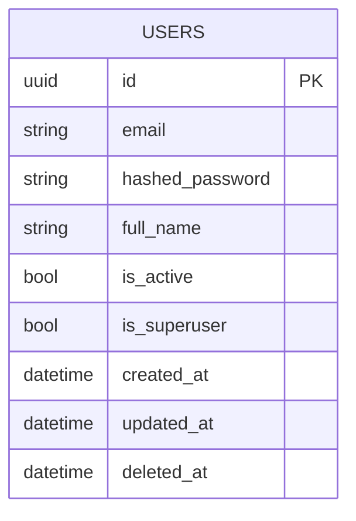

# Modelo de Datos

> Mantener sincronizado con `apps/api/app/models/`. Cada tabla
> nueva debe agregarse aquí con su propósito y relaciones.

## Convenciones generales

- Toda tabla tiene: `id (UUID)`, `created_at`, `updated_at`,
  `deleted_at` (vía `TimestampMixin`).
- Soft delete: filtrar siempre `deleted_at IS NULL`
  (lo hace `BaseRepository` automáticamente).

## Tablas actuales

### `users`
Usuario base del sistema (autenticación).

| Columna | Tipo | Notas |
|---|---|---|
| id | UUID | PK |
| email | String(255) | único, indexado |
| hashed_password | String(255) | bcrypt |
| full_name | String(255) | |
| is_active | Boolean | default true |
| is_superuser | Boolean | default false |
| created_at / updated_at / deleted_at | DateTime | TimestampMixin |

---

## Diagrama Entidad-Relación

> Mantener un diagrama actualizado en `docs/architecture/diagrams/`.
> Recomendado: Mermaid (renderiza en GitHub/GitLab) o dbdiagram.io.

<!--
Al agregar nuevas tablas, extender este diagrama. Ejemplo para
dominio académico:

    STUDENTS ||--o{ ENROLLMENTS : tiene
    SECTIONS ||--o{ ENROLLMENTS : recibe
    SECTIONS }o--|| COURSES : pertenece_a
    SECTIONS }o--|| TEACHERS : dictada_por
-->
