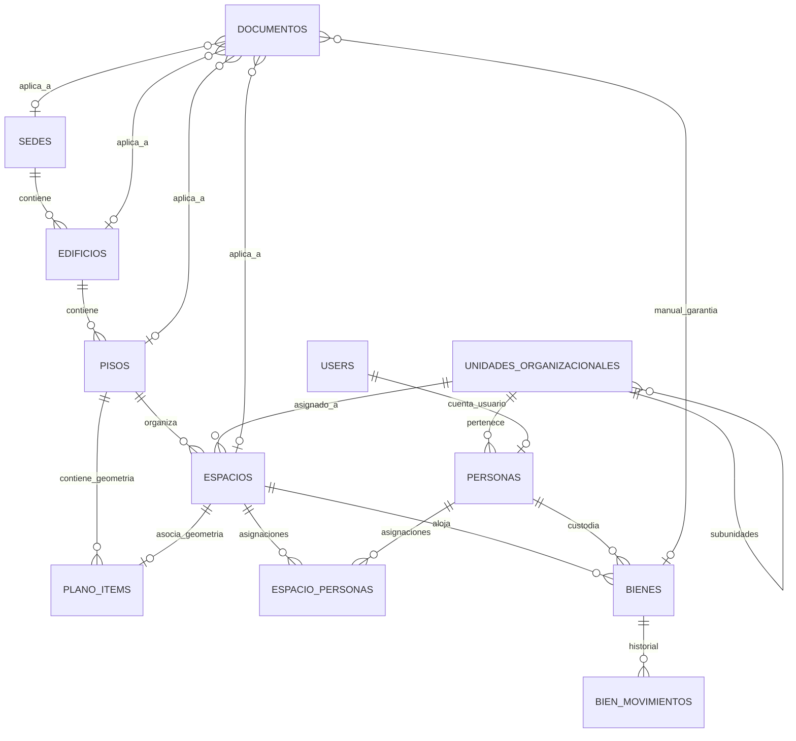

# Modelo de Datos (v4.2.0)

> Mantener sincronizado con `apps/api/app/models/`. Cada tabla
> nueva debe agregarse aquí con su propósito y relaciones.

## Convenciones generales

- Toda tabla tiene: `id (UUID)`, `created_at`, `updated_at`,
  `deleted_at` (vía `TimestampMixin`).
- Soft delete: filtrar siempre `deleted_at IS NULL`
  (lo hace `BaseRepository` automáticamente).

---

## Tablas Actuales

### 1. `sedes`
Campus o sedes universitarias/institucionales.

| Columna | Tipo | Notas |
|---|---|---|
| id | UUID | PK |
| nombre | String(255) | Requerido |
| descripcion | Text | Opcional |
| direccion | String(500) | Opcional |

### 2. `edificios`
Edificaciones dentro de una sede.

| Columna | Tipo | Notas |
|---|---|---|
| id | UUID | PK |
| nombre | String(255) | Requerido |
| codigo | String(50) | Opcional |
| sede_id | UUID | FK -> `sedes.id` (CASCADE) |

### 3. `pisos`
Niveles de un edificio con plano arquitectónico DXF/SVG.

| Columna | Tipo | Notas |
|---|---|---|
| id | UUID | PK |
| numero | Integer | Requerido |
| nombre | String(255) | Opcional |
| edificio_id | UUID | FK -> `edificios.id` (CASCADE) |
| archivo_dxf | String(500) | Nombre archivo DXF original |
| svg_data | Text | SVG generado para renderizado |
| min_x, min_y, max_x, max_y | Float | Bounds espaciales del plano |

### 4. `espacios` (Fase 1)
Entidad persistente de negocio para recintos (salas, oficinas, labs). Desacoplada de la geometría CAD.

| Columna | Tipo | Notas |
|---|---|---|
| id | UUID | PK |
| piso_id | UUID | FK -> `pisos.id` (CASCADE) |
| codigo | String(100) | Requerido, indexado (ej: A204) |
| nombre | String(255) | Opcional |
| tipo | String(100) | SALA, OFICINA, LABORATORIO, etc. |
| estado | String(50) | Disponible, Ocupado, Mantenimiento, Reservado |
| capacidad | Integer | Aforo máximo de personas |
| area_m2 | Float | Superficie calculada o declarada |
| perimetro_m | Float | Perímetro en metros |
| unidad_id | UUID | FK -> `unidades_organizacionales.id` |
| metadata_extra | Text | JSON para atributos custom |

### 5. `plano_items`
Entidades geométricas vectoriales parseadas del DXF.

| Columna | Tipo | Notas |
|---|---|---|
| id | UUID | PK |
| piso_id | UUID | FK -> `pisos.id` (CASCADE) |
| espacio_id | UUID | FK -> `espacios.id` (SET NULL) |
| tipo | String(100) | Tipo CAD |
| nombre | String(500) | Etiqueta de texto |
| capa | String(255) | Capa DXF de origen |
| x, y, ancho, alto | Float | Coordenadas bounding box |
| metadata_extra | Text | Metadata del procesador CAD |

### 6. `unidades_organizacionales` (Fase 1)
Organigrama institucional (Facultades, Escuelas, Departamentos).

| Columna | Tipo | Notas |
|---|---|---|
| id | UUID | PK |
| nombre | String(255) | Requerido |
| codigo | String(50) | Opcional, indexado (ej: FING) |
| tipo | String(100) | FACULTAD, DEPARTAMENTO, DIRECCION, etc. |
| parent_id | UUID | FK -> `unidades_organizacionales.id` |

### 7. `personas` (Fase 1)
Docentes, administrativos, estudiantes y personal externo.

| Columna | Tipo | Notas |
|---|---|---|
| id | UUID | PK |
| nombre_completo | String(255) | Requerido |
| rut_dni | String(50) | Opcional, indexado |
| email | String(255) | Opcional, indexado |
| telefono | String(50) | Opcional |
| cargo | String(255) | Opcional |
| tipo | String(50) | DOCENTE, ADMINISTRATIVO, ESTUDIANTE, EXTERNO |
| unidad_id | UUID | FK -> `unidades_organizacionales.id` |
| user_id | UUID | FK -> `users.id` (Opcional) |

### 8. `espacio_personas` (Fase 1)
Vínculo entre Espacio y Persona (Ocupante, Responsable, Brigadista).

| Columna | Tipo | Notas |
|---|---|---|
| id | UUID | PK |
| espacio_id | UUID | FK -> `espacios.id` (CASCADE) |
| persona_id | UUID | FK -> `personas.id` (CASCADE) |
| rol | String(50) | RESPONSABLE, OCUPANTE, BRIGADISTA, CONTACTO |
| puesto_identificador | String(100) | Opcional (ej: Puesto 03) |
| fecha_inicio, fecha_fin | DateTime | Vigencia de la asignación |

### 9. `users`
Autenticación y usuarios del sistema.

| Columna | Tipo | Notas |
|---|---|---|
| id | UUID | PK |
| email | String(255) | Único, indexado |
| hashed_password | String(255) | Bcrypt |
| full_name | String(255) | |
| is_active | Boolean | Default true |
| is_superuser | Boolean | Default false |

### 10. `bienes` (Fase 2)
Inventario de activos fijos y equipamiento físico geolocalizado en recintos.

| Columna | Tipo | Notas |
|---|---|---|
| id | UUID | PK |
| codigo_patrimonial | String(100) | Único, indexado (ej: QR ACT-0042) |
| nombre | String(255) | Requerido |
| categoria | String(100) | MOBILIARIO, TI_COMPUTO, CLIMATIZACION, etc. |
| marca, modelo, numero_serie | String(100) | Opcionales |
| estado_operativo | String(50) | OPERATIVO, EN_MANTENCION, DE_BAJA, etc. |
| valor_compra | Float | Opcional |
| fecha_adquisicion, fecha_garantia | Date | Opcionales |
| espacio_id | UUID | FK -> `espacios.id` (SET NULL) |
| custodio_id | UUID | FK -> `personas.id` (SET NULL) |
| pos_x, pos_y | Float | Coordenadas relativas en plano SVG |
| metadata_extra | Text | JSON para especificaciones técnicas |

### 11. `bien_movimientos` (Fase 2)
Trazabilidad y auditoría de traslados de bienes entre recintos.

| Columna | Tipo | Notas |
|---|---|---|
| id | UUID | PK |
| bien_id | UUID | FK -> `bienes.id` (CASCADE) |
| espacio_origen_id | UUID | FK -> `espacios.id` (SET NULL) |
| espacio_destino_id | UUID | FK -> `espacios.id` (SET NULL) |
| persona_responsable_id | UUID | FK -> `personas.id` (SET NULL) |
| fecha_traslado | DateTime | Timestamp del traslado |
| motivo | Text | Opcional |

### 12. `documentos` (Fase 3)
Gestión documental institucional, cumplimiento normativo (Compliance), certificados SEC, pólizas y alertas de vencimiento.

| Columna | Tipo | Notas |
|---|---|---|
| id | UUID | PK |
| nombre | String(255) | Requerido, indexado |
| tipo_documento | String(100) | CERTIFICADO_SEC, PERMISO_EDIFICACION, TITULO_DOMINIO, POLIZA_SEGURO, etc. |
| descripcion | Text | Opcional |
| archivo_path | String(500) | Ruta local segura de almacenamiento |
| archivo_nombre | String(255) | Nombre del archivo subido |
| archivo_peso_bytes | BigInteger | Tamaño en bytes |
| archivo_mime_type | String(100) | application/pdf, image/png, etc. |
| fecha_emision | Date | Fecha de expedición |
| fecha_vencimiento | Date | Indexada, base para semáforo de vigencias |
| emisor_entidad | String(255) | Organismo emisor (ej: SEC, Municipalidad) |
| numero_folio | String(100) | Código oficial / folio |
| sede_id | UUID | FK -> `sedes.id` (CASCADE) |
| edificio_id | UUID | FK -> `edificios.id` (CASCADE) |
| piso_id | UUID | FK -> `pisos.id` (CASCADE) |
| espacio_id | UUID | FK -> `espacios.id` (CASCADE) |
| bien_id | UUID | FK -> `bienes.id` (CASCADE) |
| metadata_extra | Text | JSON adicional |

---

## Diagrama Entidad-Relación

