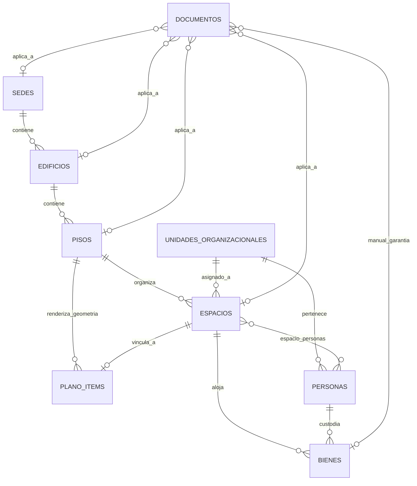
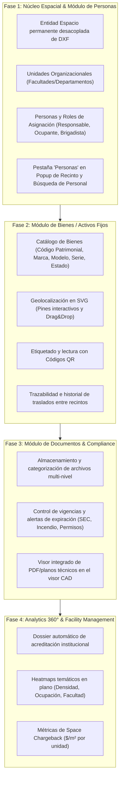

# 🗺️ MInfra — Plan Estratégico y Arquitectura por Fases (v4.2.0)
## Ampliación de Space Management: Documentos, Bienes y Personas

---

## 📌 1. Visión y Diagnóstico General

**MInfra** es una plataforma CAFM/IWMS orientada a la gestión integral de infraestructura física multisede para educación superior y organizaciones corporativas.
Actualmente cuenta con una base operativa sólida para la **Gestión de Espacios (Space Management)**:
- **Jerarquía:** Sede → Edificio → Piso → Recinto (Geometría DXF/SVG).
- **Motor CAD:** Ingesta inteligente de archivos DXF (`ezdxf`), delimitación IQR, raycasting para reconstrucción de recintos y cálculo de áreas/perímetros en $\text{m}^2$.
- **Visor Interactivo:** Renderizado SVG vectorial de alta fidelidad con capas, rotación (90°/180°/270°), zoom, pan y popup de edición rápida.

### ⚠️ Desafío Arquitectónico Clave (Resuelto en Fase 1)
En la versión inicial, la re-subida de un plano DXF eliminaba los `PlanoItem` del piso (`delete_by_piso`). Para permitir la vinculación relacional de Personas, Bienes y Documentos sin riesgo de pérdida de datos ante cambios arquitectónicos en los planos, se establece el **desacoplamiento entre la Geometría CAD (`PlanoItem`) y la Entidad de Negocio Persistente (`Espacio`)**.

---

## 🏗️ 2. Arquitectura de los Nuevos Dominios

---

## 🚀 3. Hoja de Ruta por Fases

---

### Detalle de Fases:

### 🔹 Fase 1: Núcleo Espacial & Personas (En curso)
- **Base de Datos:** Tablas `espacios`, `unidades_organizacionales`, `personas`, `espacio_personas`.
- **Backend:** Servicios CRUD, vinculación inteligente de geometrías `PlanoItem` $\leftrightarrow$ `Espacio`.
- **Frontend:** Pestaña de Personas en el popup del recinto, asignación de responsables, cálculo de aforos y directorio de búsqueda rápida de personal.

### 🔹 Fase 2: Bienes / Activos Fijos
- **Base de Datos:** Tablas `bienes` y `bien_movimientos`.
- **Backend:** CRUD de activos, generación de QR dinámicos, endpoint de trazabilidad.
- **Frontend:** Capa visual de activos en `dxf-viewer.tsx`, asignación de custodios, vista de inventario general.

### 🔹 Fase 3: Documentos & Cumplimiento Normativo
- **Base de Datos:** Tabla `documentos` polimórfica/jerárquica.
- **Backend:** Servicio de almacenamiento de archivos, cron de chequeo de fechas de vencimiento.
- **Frontend:** Gestor de documentos en sidebar y popup de recinto, visor de PDFs embebido.

### 🔹 Fase 4: Facility Management 360° & Reportes Avanzados
- **Backend:** Agregaciones avanzadas cruzando Espacio + Persona + Bien + Documento.
- **Frontend:** Capas de mapas de calor (Heatmaps) en el visor CAD, exportación de reportes ejecutivos para acreditación (CNA/ISO).

---

## 🖥️ 4. Consideraciones de Entorno & Despliegue (OCI e3micro / Ubuntu Minimal)

Dado que el desarrollo se realiza localmente y el despliegue/pruebas en una instancia **Oracle Cloud Infrastructure (OCI) e3micro** con **Ubuntu Minimal**:

1. **Eficiencia de Memoria y CPU:**
   - Stack ligero basado en **FastAPI (asyncpg)** y **Next.js standalone build**.
   - Conexiones a PostgreSQL optimizadas mediante pool connection limits (`pool_size=5`, `max_overflow=10`).
   - Sin dependencias pesadas de procesamiento en segundo plano que saturen la memoria RAM.
2. **Contenedorización & Docker Compose:**
   - Servicios separados: `api`, `web`, `postgres` y `redis` (opcional/on-demand).
   - Uso de multi-stage builds en Dockerfiles para reducir imágenes a menos de 150MB.
3. **Persistencia & Backups:**
   - Volúmenes montados para `/storage/documents` y base de datos PostgreSQL.
